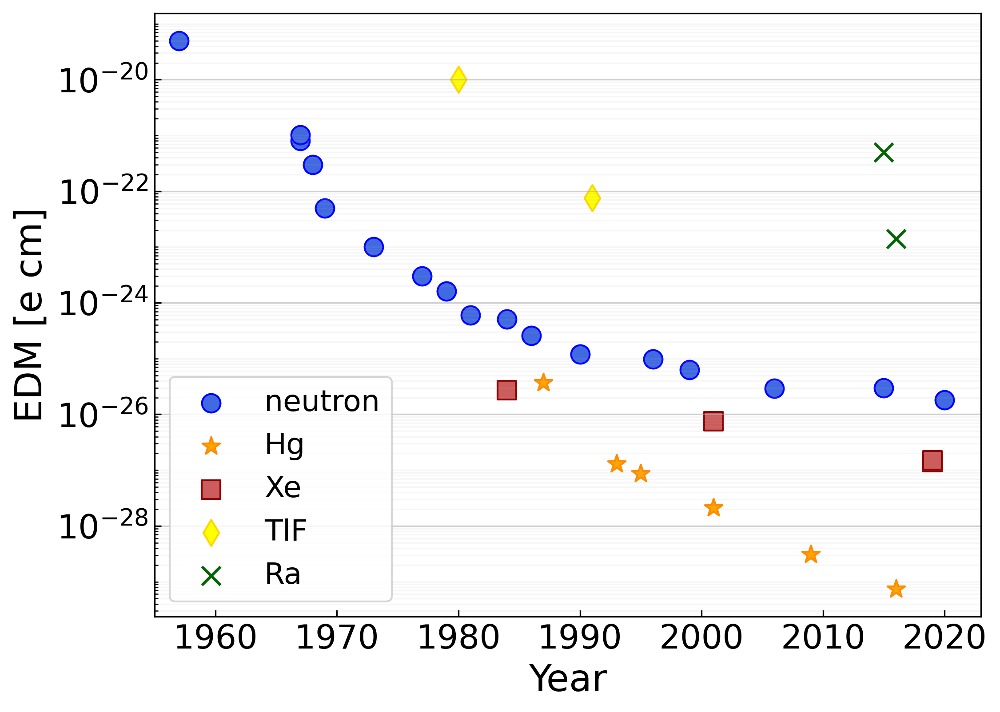
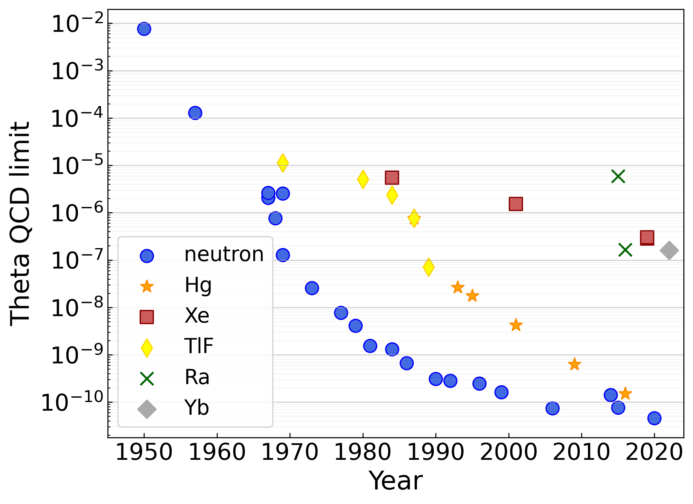
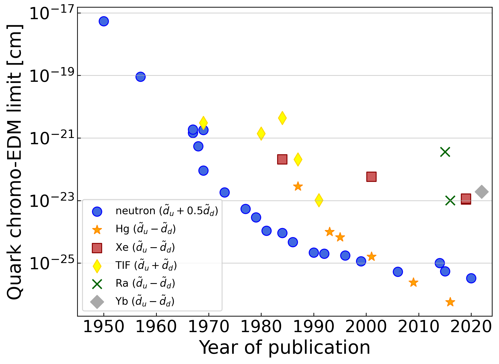
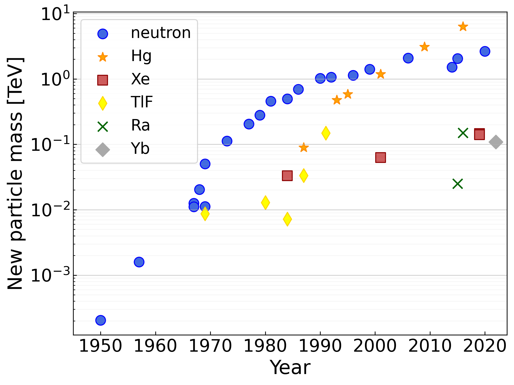

Introductory text

---

  

# **Hadronic EDMs**
test text\
test text\
test text\

---

  

# **Theta QCD bounds**
test text\
test text\
test text\
  &nbsp; \
&nbsp; 

---

 

# **Quark chromo EDM bounds**
test text\
test text\
test text\
  &nbsp; \
    &nbsp; \
 &nbsp; 

---

# **New particle mass reach**

