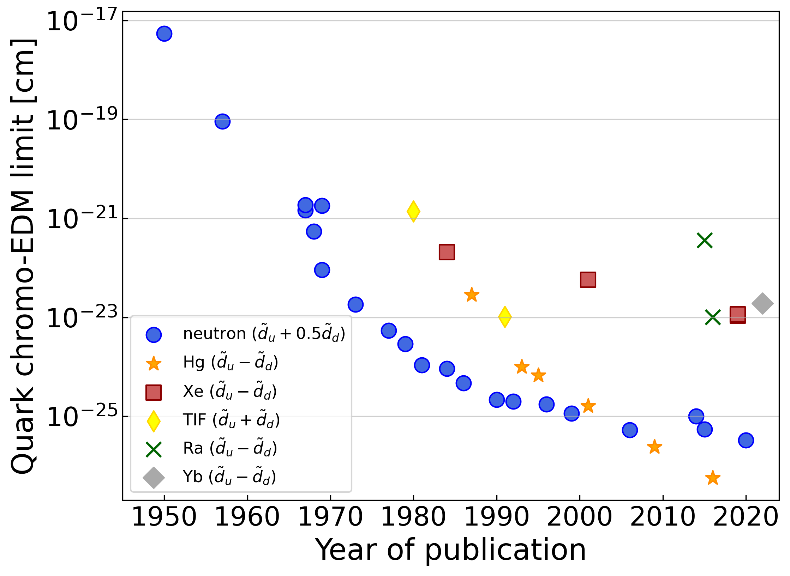

This is a community resource for making EDM plots.  The most reliable numbers are the measured EDM values (found in the [data files](https://github.com/Jayich-Lab/EDM-Limits/tree/main/data).  Bounds on Theta QCD, etc. are derived from the EDM values and rely on conversion factors that come with their own uncertainties.  The new particle mass reach is not based on published values and should be taken as illustrative.  This repository is a work in progress (see the [To-Dos](#To-Dos) ), but I wanted to make this public to streamline data access and to receive feedback.  

---

  

# **Hadronic EDMs**
plot: [png](https://github.com/Jayich-Lab/EDM-Limits/raw/main/plots/hadronic-edm-limits.png), [pdf](https://github.com/Jayich-Lab/EDM-Limits/raw/main/plots/hadronic-edm-limits.pdf) \
&nbsp; \
&nbsp; \
&nbsp; \
&nbsp; \
&nbsp; 

---

  

# **Theta QCD bounds**
plot: [png](https://github.com/Jayich-Lab/EDM-Limits/raw/main/plots/theta-qcd-limits.png), [pdf](https://github.com/Jayich-Lab/EDM-Limits/raw/main/plots/theta-qcd-limits.pdf) \
&nbsp; \
&nbsp; \
&nbsp; \
&nbsp; \
&nbsp; 

---

 

# **Quark chromo EDM bounds**
plot: [png](https://github.com/Jayich-Lab/EDM-Limits/raw/main/plots/quark-chromo-edm-limits.png), [pdf](https://github.com/Jayich-Lab/EDM-Limits/raw/main/plots/quark-chromo-edm-limits.pdf) \
&nbsp; \
&nbsp; \
&nbsp; \
&nbsp; \
&nbsp; 

---

# **New particle mass reach**
plot: [png](https://github.com/Jayich-Lab/EDM-Limits/raw/main/plots/new-particle-limits.png), [pdf](https://github.com/Jayich-Lab/EDM-Limits/raw/main/plots/new-particle-limits.pdf) \
&nbsp; \
&nbsp; \
&nbsp; \
&nbsp; 

# To-Dos

* Yb-171 limit
* Make references more accessible
* Include all conversion factors (with references), and set some as “default” for making plots.
* Report limits on “quark cEDMs” as a normalized linear combination of d_u & d_d e.g. (1/sqrt(2)) (d_u – d_d) or (1/sqrt(5))(2d_d + d_u).
* electron EDMs
* Unify confidence limits
* Cs MQM
* Published values to support the new particle mass reach

# Acknowledgements
This repository was inspired by https://github.com/cajohare/AxionLimits

**Thank you to**: Jordy De Vries, Dave DeMille, Luka Sever-Walter, and Jaideep Singh for help making the plots.

