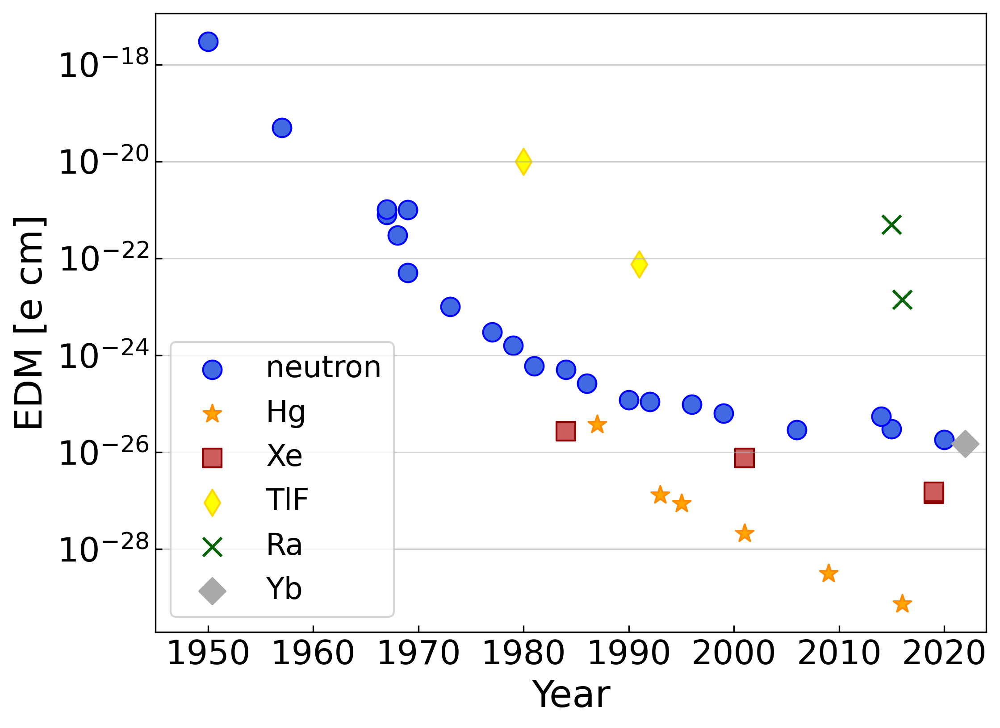

This is a community resource for making EDM plots.  The most reliable numbers are the measured EDM values.  Bounds on Theta QCD, etc. rely on conversion factors that come with their own uncertainties.  This is very much a work in progress (see the [To-Dos](#To-Dos) ) but I wanted to get this public so accessing the data is easy and so that I can receive feedback.  

---

  

# **Hadronic EDMs**
test text\
test text\
test text\
test text\
test text\
test text\

---

  

# **Theta QCD bounds**
test text\
test text\
test text\
  &nbsp; \
&nbsp; 

---

 

# **Quark chromo EDM bounds**
test text\
test text\
test text\
  &nbsp; \
    &nbsp; \
 &nbsp; 

---

# **New particle mass reach**

test text\
test text\
test text\

# To-Dos

* Yb-171 limit
* Make references more accessible
* Include all conversion factors (with references), and set some as “default” for making plots.
* Report limits on “quark cEDMs” as a normalized linear combination of d_u & d_d e.g. (1/sqrt(2)) (d_u – d_d) or (1/sqrt(5))(2d_d + d_u).
* electron EDMs
* Unify confidence limits
* Cs MQM

# Acknowledgements
This repository was inspired by https://github.com/cajohare/AxionLimits

**Thank you to**: Jordy De Vries, Dave DeMille, Luka Sever-Walter, and Jaideep Singh for help making the plots.

